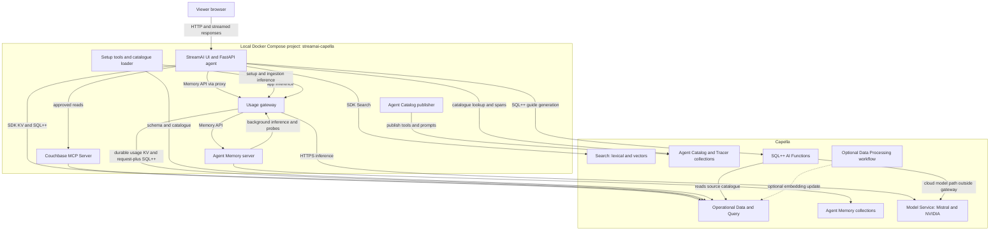
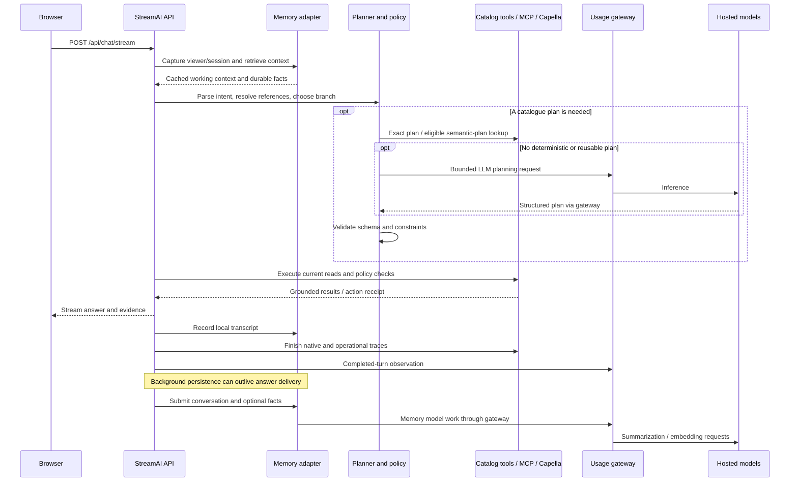
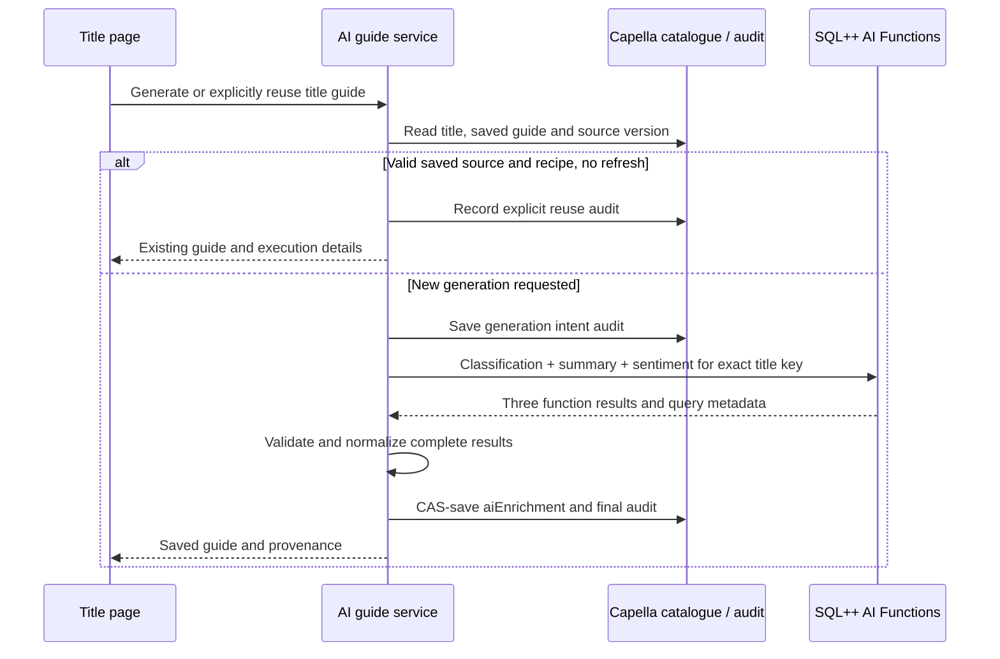

# StreamAI 1.1.0 — architecture and execution guide

**Audience:** solution engineers, demo operators and developers. **Release date:** 28 September 2026.

This document describes the implementation in this package, from the launcher to the response and its subsequent background work. It distinguishes Couchbase capabilities from StreamAI application logic and from optional features. For installation, use [README.md](README.md); for formulas and exclusions, use [METRICS-AUDIT.md](METRICS-AUDIT.md).

## The design in one view

StreamAI combines four different kinds of information:

1. **Operational facts:** what is in the catalogue, what the viewer watched or liked, their subscription/region and the current rules.
2. **Conversation and profile memory:** what was said and which durable preferences should carry across sessions.
3. **Semantic representations:** vectors that help retrieve catalogue candidates and, where enabled, similar validated plans or memory blocks.
4. **Governed operations:** bounded plans and approved tools that read current facts and validate proposed actions.

The application controls when to use each. An LLM is one component; it is not the authority for catalogue existence, permissions or whether a write succeeded.



The four services that remain running are `ui`, `memory`, `mcp` and `usage`. `tools` and `publisher` run as setup tasks. The database and hosted inference run in Capella; this release does not host the UI, MCP or Memory server inside the Capella Operational cluster.

## Component responsibilities

| Component | Implementation | Role and behavior |
| --- | --- | --- |
| Web interface | `ui/static/index.html`, `app.js`, `styles.css` | Media browsing, chat, title guide, profile/memory, presenter controls and evidence. Plain browser JavaScript/CSS served by FastAPI. Customer/showcase modes control visibility. |
| API/lifecycle | `ui/app/main.py` | Initializes services, routes requests, chooses chat branches, streams events, captures observations and schedules post-response work. |
| Operational catalogue service | `catalogue_service.py` | KV/SQL++ access to titles, profiles/history, Search retrieval, eligibility filtering, rankings, plan persistence and operational metrics/trace projections. |
| Preference policy | `preference_policy.py` | Normalizes and applies supported explicit positive/negative preference rules. Deterministic rules do not establish perfect understanding of arbitrary language. |
| Model adapter | `llm_service.py`, `providers.py` | Chat/planner requests and embeddings through the configured provider; local intent extraction and grounded rendering. `LocalModelService` is a historical class name, not an assertion that inference runs locally. |
| Planner | `planner_service.py` | Creates a bounded structured plan, validates it and attempts exact/semantic reuse. The LLM interprets language only when a deterministic plan is unavailable. |
| Governed agent | `agent_service.py` | Tool registry, approved execution paths, resolved-title and policy checks, action orchestration and per-turn evidence. This is custom application orchestration, not LangGraph or an autonomous unrestricted tool loop. |
| Agent Catalog integration | `agent_catalog_gateway.py`; `ui/agent_catalog` | Resolves published prompt/tool definitions and emits typed native spans. StreamAI executes catalogued tools through its executor. |
| MCP integration | `mcp_gateway.py`; `mcp-server` | Keeps a streamable HTTP MCP connection, adapts tool arguments and translates business reads into database primitives. Read-only credentials restrict this path. |
| Memory adapter | `memory_service.py` | Wraps the Agent Memory SDK, manages viewer/session context, maintains immediate local working context, submits conversations/facts and retrieves stored blocks. |
| Profile mirror | `profile_memory_sync.py` | Idempotently mirrors explicit operational preferences into a dedicated long-term Memory session; tracks accepted/stored/ready state. |
| UI state store | `state_store.py` | Stores salted PIN hashes and resumable transcript/session state in Capella KV. It is separate from the Memory service's users/sessions/blocks. |
| Agent Memory server | Derived image under `agent-memory-capella` | Stores memory in Capella and runs asynchronous summarization/embedding. Compatibility patch supplies NVIDIA input types and bounded Mistral health requests. |
| AI Functions integration | `capella_ai_services.py`, `ai_enrichment.py` | Generates, validates, saves and reuses title guides; records execution audits and handles stale source text. |
| Usage reporting | `usage_reporter.py` | Reports app operations, obtains measured gateway summaries, surfaces reporting gaps and keeps external-service activity separate. |
| Usage gateway | `usage-gateway/server.py`, `storage.py`, `ledger.py`, `memory_trial.py` | Proxies model/Memory API calls; persists events, settings and trial receipts in Capella; computes measured Memory-policy differences. |
| Showcase service | `showcase_service.py` | Persona setup, search comparison, recommendation evidence, policy simulation, resilience controls, evaluations and profile timeline. Demonstration scores are heuristic, not measured production accuracy. |
| Bootstrap/loader | `START-CAPELLA.sh`, `scripts/capella-common.sh`, `tools` | Configuration, schema/index setup, model validation, initial catalogue load and readiness checks. |
| Catalog publisher | `agent-catalog-publisher/publish.sh` | Builds/publishes native tools/prompts and emits the snapshot included in the UI image. Uses Git inside its container and local catalogue embeddings. |

Couchbase Agent Catalog manages tools/prompts and activity; the application/framework executes tools. Agent Memory manages persistent memory but does not supply the agent's reasoning or host its models. [Agent Catalog](https://docs.couchbase.com/ai/build/integrate-agent-with-catalog.html) · [Agent Memory](https://docs.couchbase.com/ai/build/agent-memory/about-agent-mem.html)

## Startup from command to ready application

### Configuration and preflight

`START-CAPELLA.sh` resolves its own directory, including paths containing spaces. `scripts/capella-common.sh` selects `capella.env` unless `CAPELLA_CONFIG` specifies another file. It checks Bash syntax, exports the user values, normalizes model endpoint roots and sources `config/capella-runtime.sh`.

The runtime file supplies Capella defaults, fixed model names/dimensions, planner settings and optional-service controls. It deliberately overwrites some settings; others use `${NAME:-default}` and can be overridden. Compose receives explicit variables. Its project name is always `streamai-capella`, its project directory is the extracted folder, and its dotenv file is `/dev/null`.

Preflight rejects an unsupported host architecture, unset placeholder credentials, non-TLS cluster strings, malformed model endpoint roots, a missing CA or a selected workflow without an ID. It checks Docker/Compose and resolves the Compose definition. The selected configuration file is made owner-readable/writable; the public certificate is readable for container mounts.

### Seven launcher stages

1. **Couchbase meter first.** Build `tools` and `usage`; stop existing UI/Memory/MCP producers. `tools/bootstrap_usage.py` provisions the telemetry collection and usage index using setup credentials, then waits for and verifies any old meter transfer before creating Couchbase settings. Start the new gateway and check that its health response identifies the expected Couchbase ledger. Only then allow setup inference. The bootstrap makes no model calls.
2. **Real connectivity probes.** `scripts/12-validate-environment.py` validates the target. `tools/check_capella_models.py` calls chat with streaming and both query/passage embeddings. These are real model operations, recorded under `setup`.
3. **Data and indexes.** `tools/capella_setup.py prepare` runs `provision_content_plane.py`, verifies the Memory bucket, checks existing catalogue/model compatibility, then creates or updates scoped Search definitions. Existing replica/partition settings are retained when updating mappings. It loads only an empty catalogue or resumes a bootstrap marked `loading`; it preserves populated catalogues. It waits for complete 2048-dimension vectors and Search indexing.
4. **Runtime images.** If necessary, import `vendor/agentmemory-server-arm64-1.0.0-rc2.tar` and tag it as the local base. Build the derived Memory image, MCP and publisher. The Memory patch validates expected source matches before modifying the supplied image; it is not a general patch for arbitrary future server versions.
5. **Memory and MCP.** Start both. Memory initializes/connects its storage and processing services. The setup task waits for healthy Memory before proceeding; MCP's required primitives are checked through application startup/status.
6. **Published agent and UI.** Run the publisher using the source tools/prompts and publishing identity. It indexes/embeds and publishes to Capella, writes `tools.json`, `prompts.json` and `streamai-publish.json` under `ui/.agent-catalog`, and maintains source version metadata inside its container. The launcher verifies those artifacts, builds the UI image and starts it.
7. **Application checks.** Wait for `/api/readiness`, check required services via `/api/status`, then verify plan-cache SQL++ statistics and its Search index. Enabled optional services must report healthy. An AI Functions status check is not an actual guide-generation test; perform that feature once before presenting.

The ingestion bootstrap record is `streamai::capella-bootstrap` in `operations.ingestion_jobs`. It records model/dimensions and loading state so an interrupted setup can be resumed. This is not a migration system for changing embedding models.

### FastAPI startup and shutdown

FastAPI starts initialization in a background task so the page can display progress. It constructs the model adapter, Memory adapter/state store, catalogue service, planner, MCP connection, native Catalog gateway, governed agent, AI Functions service and optional Showcase service. Only then are the shared service references made available.

A startup exception is retained and surfaced through readiness/status. APIs wait for initialization up to the configured startup timeout and return an error if it fails. `/health` reports process/application readiness; `/api/status` performs the richer dependency checks.

Shutdown waits up to 12 seconds for tracked application background tasks, then cancels unfinished tasks and closes MCP, database and model/Memory clients. This is bounded shutdown, not a durable application job queue. The Memory server has its own processing lifecycle; accepted asynchronous work and persisted blocks must be distinguished from completed enrichment.

## Catalogue ingestion and retrieval

### Content preparation

`tools/load_catalogue.py` obtains TMDB movies/TV metadata or six fictional samples, normalizes it and writes title documents. Title IDs use forms such as `movie::<id>` or `tv::<id>`. Documents contain title, overview, genres, people, language, runtime/rating and artwork references, plus an `embeddingText` representation.

The demo adds deterministic availability/subscription fields with provenance `streamai_demo_entitlement_policy`. These fields illustrate business rules; they are not a licensed provider's rights feed. Viewer entitlements default to a configured region/tier and may be seeded for demo personas. Initial viewer/history seeding occurs only when those datasets are empty during first catalogue bootstrap.

Under `python_loader`, passage embeddings go through the usage gateway's `ingestion` route to the NVIDIA endpoint. Under `capella_workflow`, the loader writes source fields and waits for a separately provisioned workflow to write vectors. The app does not start a cloud workflow using the configured ID. Coverage and dimensionality checks establish usable output, not workflow-control or billing evidence.

Reloading an existing title uses compare-and-swap and preserves saved `aiEnrichment`. If source title/overview changes, the guide's fingerprint no longer matches and it is treated as stale. The loader is an upsert/update flow; it does not remove all documents missing from the latest import.

### Search paths

- **Lexical:** field-aware Search queries match titles, genre/people and overview terms. Structured fields can also use parameterized SQL++ filters.
- **Vector:** a query embedding searches title vectors in `streaming-catalogue-search`. “Because You Watched” can use a stored title vector directly, avoiding a fresh query embedding for that seed.
- **Hybrid:** combines lexical and semantic candidate evidence, then applies deterministic constraints and ranking.
- **Fallback:** when Search is unavailable or times out, supported requests can fall back to structured queries/genre candidates. Evidence reports the actual retrieval mode; fallback is not equivalent semantic quality.

The Capella profile uses the Couchbase SDK Search transport and TLS service discovery. It does not hard-code a single-node Search HTTP address. The catalogue Search index is scoped to `streaming.catalogue`; the separate plan-cache index is scoped to `streaming.recommendations`.

Vector similarity finds candidates; it is not a reliable negation parser, an age-suitability rating or a probability of user satisfaction. A phrase such as “clever, not frightening” requires intent/rule validation beyond matching semantically related catalogue descriptions. Supported filters and entity resolution constrain results, but the demo does not establish comprehensive natural-language intent accuracy.

### Home-page recommendations

Home shell and rows load separately. The service combines operational profiles, watch history, likes/dislikes and policy. No home carousel makes a direct Agent Memory lookup.

| Row | Algorithm and practical boundary |
| --- | --- |
| Top Picks | Candidate ranking using positive operational profile/history evidence and preference/eligibility exclusions. This is application logic, not a trained Netflix-scale recommender. |
| Because You Watched / Started | Select latest watch event with progress > 0; retrieve neighbours of its stored title vector; apply recommendation exclusions and policy; use a genre fallback if Search fails. Completion threshold determines the wording. |
| Trending Now | Global popularity/rating ranking followed by entitlement and disliked-title filtering. It does not apply the entire negative genre/theme policy used by personalized recommendation paths. |
| Continue / Recently Watched / My List | Operational history/progress and profile list membership, with appropriate title decoration/policy. |

In-process caches improve repeated reads. Defaults include home 300 seconds, rows 180 seconds and global trending 600 seconds; some activity rows use shorter TTLs. Supported viewer writes invalidate relevant caches/versioned recommendations. External database edits can remain unseen until cache expiry, and Search indexing has its own freshness. “Live data” does not mean every rendered card is guaranteed to reflect every external write instantaneously.

## A chat turn, step by step



This is a conceptual sequence: exact ordering varies by branch, and some events are streamed before final trace/telemetry work. The model gateway forwards responses; it does not validate business policy.

1. **Bind the turn to a viewer/session.** `prepare_turn` captures a `TurnTarget` so a later viewer/session change does not redirect that turn's background memory write.
2. **Retrieve context.** The default uses the adapter's active transcript and cached durable profile facts. Deep semantic memory search on every chat is disabled by default (`SEMANTIC_RETRIEVAL_IN_CHAT=false`) to keep it off the critical response path. The Memory inspector/manual search uses the actual Memory API. A locally satisfied context read is not counted as a Memory HTTP request.
3. **Create trace and identify intent.** Parse actions, profile/preferences, history, region, follow-up references, title questions, catalogue counts/analytics, similarity and discovery requests. Supported preference statements are extracted deterministically and update the operational profile. Previous grounded title IDs help resolve “the second one” safely.
4. **Select an execution path.** Specific operational questions/actions can go straight to approved deterministic tools. Catalogue requests may use the planner. The current chat router primarily renders grounded deterministic replies. The planner can use an LLM when no deterministic plan is available; a message is not automatically a generative call.
5. **Read current facts.** Resolve real title IDs, execute bounded database/search operations, apply current eligibility/preferences and check requested write actions. Tool definitions come from the published catalogue when required; eligible business reads execute through MCP.
6. **Render a grounded answer.** Structured paths format actual returned rows/values. A title overview can reuse a valid saved AI viewing guide and label its origin. Planner structures remain bounded and validated. A generic stream_answer helper exists but is not evidence that the current router invokes it. Returned operational evidence grounds the reply.
7. **Record evidence and background work.** Update immediate transcript/state, finish native and operational traces, report the completed chat and submit conversation/facts to Memory. Eligible new plan templates can be vectorized/promoted after the foreground execution. Their inference also counts.

The endpoint streams newline-delimited JSON events rather than delivering a single blocking response. The visible server-answer time does not include every subsequent persistence/trace/metering task or browser-network delay.

## Plans, reuse and governed actions

### What a plan is

A plan is a validated data structure: intent, supported filters, sort, result limit and optional analytical fields. It is not arbitrary SQL or executable model-supplied code. Allowed intents include catalogue query, recommendation, similarity, catalogue analytics and unknown. Results are bounded (typically up to 20); sort/group/measure choices are allowlisted.

For “show five highly rated movies from last year”, a suitable plan identifies the movie filter, relative release period, rating order and limit. Execution resolves relative dates and current catalogue/policy. The planner's confidence is a heuristic routing/cache threshold, not a measured accuracy probability.

### Planner decision order

1. Build deterministic constraints and a compatibility guard from the current request.
2. Attempt exact cache lookup keyed by normalized query plus application/planner/tool-schema versions.
3. Where eligible, try semantic candidates, using threshold 0.92 and a bounded probe budget. Require compatible intent/field/time/personalization guards, rebind slots and validate again. Contextual references are not eligible for semantic template reuse.
4. Use a deterministic plan when available. Otherwise, call the configured planner model under a timeout and validate its output. On failure, use the supported fallback/unknown route; do not treat a failed model call as free.
5. Cache sufficiently confident, non-unknown templates. Exact KV persistence occurs before optional background semantic promotion.

Plans default to a 30-day TTL. Schema/app versions reject incompatible cached entries. Version 1.1.0 warms new plan entries because app version is a compatibility key.

**Reusing a plan avoids creating that plan again; it does not reuse a stale final answer.** Every execution reads current data and policy. An exact hit need not create a new embedding; a semantic probe can. A template originally created deterministically is not proof that an LLM call was saved on its first use.

### Catalog, MCP and writes

The native Catalog holds approved tools and the system prompt. `AgentCatalogGateway` resolves definitions; `MCPGateway` maps supported business reads to primitives such as `get_document_by_id`, `run_sql_plus_plus_query` and schema inspection. The MCP server exposes more database tools than the assistant's allowlist uses. Prompt text is not the security boundary: database RBAC and application validation matter.

Write actions such as watchlist/like/progress changes remain in StreamAI's business service. The application resolves a real title, validates action/policy, writes through its Couchbase SDK and records an action receipt. The read-only MCP identity is not given write privileges to achieve this. Some ordinary UI reads also use the SDK directly; not every data access is an MCP call.

Policy decisions can distinguish denied, included and separately purchasable content. A title being discoverable does not mean it is included in the viewer's subscription. Demo “play” records progress rather than serving video or charging a customer.

## Agent Memory lifecycle

### Storage and immediate context

Agent Memory's SDK targets the locally running Memory server through the usage service's `/memory-api` proxy. The Memory server stores users, sessions and blocks in `agent_memory.agentmemory`. The app separately stores UI authentication and fast resumable context in `streaming.viewers.app_state`.

For responsive chat, the adapter records the answer in its working context immediately. It then submits the user/assistant pair as a short-term block with `memory_scope=short_term`, `memory_type=conversation` and a default 3,600-second TTL. Captured durable facts use `memory_scope=long_term` and TTL 0, subject to cluster retention settings.

Asynchronous processing means **accepted → stored → enriched/ready** are separate states. The Memory server can call the LLM for summaries and the embedding model for semantic representations. Those calls consume resources even though the answer is already on screen. A block that is pending or failed must not be presented as ready for semantic recall.

### Explicit profile synchronization

Operational profile preferences remain authoritative for the application. `profile_memory_sync.py` creates a stable session `streamai-profile-<hash>` and marks owned blocks with `source=streamai_operational_profile_sync`.

Sync reads paginated server blocks, adds missing preference facts and removes obsolete/duplicate blocks only from its own mirror after additions are accepted. It retains other conversational/manual memories. It runs on login/registration, supported persona seed/reset, profile changes and chat preference updates; My Profile also exposes an explicit retry. Read-only profile inspection does not itself write a mirror.

The mirror covers explicit genres, themes, people, languages, content-type choices, runtime and content restrictions. Seeded likes and watch history are operational records, not automatically copied by this reconciliation. New interactions may submit their own facts using other paths. The UI labels operational-only entries separately from actual Memory blocks.

### Health probes and the version 1 correction

The supplied Memory server performs actual LLM and embedding requests to check model health. The earlier configuration refreshed around every 15 seconds. In live r9 records, a recurring LLM ping returned 105 output tokens because its `max_completion_tokens` limit was not effective on this Mistral endpoint.

The derived version 1 image uses `max_tokens=1` and temperature 0 for **Mistral health probes only**. A real endpoint check returned five input tokens and one output token with this setting. This health fix is retained. Version 1.1.0 also skips optional summaries of short turns and explicit facts, preserving originals and embeddings.

The default refresh interval is now 300 seconds, with a 600-second cache TTL; both are overridable in `capella.env`. The server prewarms at startup, refreshes in the background and serves cached model status to frequent HTTP health checks. The refresh interval must be smaller than the cache TTL. Model outages can take up to the refresh interval to be reflected in cached status; actual inference requests still report their failures when they occur.

These changes reduce unnecessary idle work. They do not remove the cost of storing/enriching memories, hide probes from the ledger, erase existing usage or guarantee positive net savings.

## AI Functions: generated guide to visible reuse



The query reads one title using its document key and verifies the expected source text. It requests:

- `default:ai_classification` for title/overview against the configured mood labels.
- `default:ai_summary` for the overview.
- `default:ai_sentiment` for the overview's tone.

Default generation settings are temperature 0.1, 220 max tokens for classification/sentiment and 120 max words for summary. Synopsis tone is not audience sentiment. AI output does not replace an age rating or entitlement decision.

`ai_enrichment.py` requires a complete, nonempty success shape. Saved data includes schema version, output, source fingerprint, recipe, generation time, duration, execution ID and Query request ID where provided. It does not assert an exact hosted deployment ID; the associated AI Functions model is configured in Capella.

A bounded process-local lock serializes same-title generation attempts. Compare-and-swap prevents overwriting a concurrent title edit. The initial audit must persist before inference. Failed/partial results do not become a successful new guide. Existing data is preserved if regeneration fails; a source mismatch makes it stale rather than silently current.

Reopening a title reads the guide without incrementing reuse activity. **Reuse saved guide** records explicit reuse, and **Ask the assistant about this title** uses the saved summary/mood in the normal chat flow. Chat trace response mode `catalogue_ai_guide_reused` and the guide's execution ID establish the connection. Background Memory work may still follow the chat.

The generation's durable audit lives in `telemetry.ai_metrics`; it is not itself a native Agent Tracer span. Generation bypasses the local inference gateway because model execution originates in Capella. Three returned function values do not prove exactly three upstream requests: cloud retries/caches are not observed. Token usage and cost for this path are unknown in this integration. [AI Functions](https://docs.couchbase.com/ai/build/ai-functions.html)

## Persistence and ownership

The following names are the default deployed layout. The native SDK owns its schemas; do not move those collections merely to put all agent-related data in one bucket.

| Keyspace / storage | Owner and contents |
| --- | --- |
| `streaming.catalogue.titles` | Media metadata, availability, embedding source/vector and saved `aiEnrichment` |
| `streaming.catalogue.people`, `genres` | Provisioned supporting catalogue collections; primary runtime title reads use denormalized title documents |
| `streaming.viewers.profiles` | Explicit preferences, liked/disliked IDs and lists; operational personalization source |
| `streaming.viewers.watch_history` | Viewer/title progress and last-watch timestamps |
| `streaming.viewers.interactions` | Operational interaction records |
| `streaming.viewers.app_state` | Demo login hashes and resumable application context; not the Memory API's block store |
| `streaming.recommendations.plan_cache` | Versioned validated templates, compatibility guards, optional vectors, hit/expiry metadata |
| `streaming.recommendations.traces` | App-readable retrieval/agent trace projection and response evidence |
| `streaming.recommendations.generated` | Provisioned application recommendation collection; not a replacement for current-data execution or an AI response-cache guarantee |
| `streaming.operations.entitlements` | Authoritative demo viewer region/subscription/parental policy |
| `streaming.operations.action_receipts` | Evidence of governed operational actions |
| `streaming.operations.agent_catalog` | Application tool/agent registry projection; distinct from native Agent Catalog |
| `streaming.operations.ingestion_jobs` | Loader/bootstrap manifests and ingestion status |
| `streaming.agent_catalog.tools`, `prompts`, `metadata` | Native published catalogue, as used by tested agentc 1.1.2 |
| `streaming.agent_activity.logs` | Native Agent Tracer log events with session/span/content structure |
| `streaming.telemetry.ai_metrics` | Primary usage events (`streamai_measured_usage`), reporting settings (`streamai_usage_state`), AI-guide audit (`streamai_ai_function_event`) and retained legacy documents distinguished by type |
| `streaming.telemetry.showcase_state`, `experiments`, `evaluations`, `profile_snapshots` | Presenter state, search experiments, evaluation output and profile timeline |
| `agent_memory.agentmemory.users`, `sessions`, `memory` | Native Memory identities, sessions and short/long-term blocks |
| Docker `agent-activity`, `memory-logs`, `catalog-model-cache` volumes | Native local activity artifacts, Memory logs and publisher model cache |
| Host `ui/.agent-catalog` | Generated publish snapshot included in the UI image; rebuild after republishing |

Full names of the remaining Docker volumes are prefixed with `streamai-capella_`. They hold logs/activity artifacts and caches. Couchbase is the only application database, including primary usage history and settings; the usage gateway has no data volume. Restarting/recreating it reads its state from Capella. An old unused usage volume can remain from an upgrade, but is neither mounted nor read by this release.

### Reading proof in Capella

For a known title, read `streaming.catalogue.titles` by key and inspect `aiEnrichment`. For an execution ID, use key `ai-function-event::<execution ID>` in `streaming.telemetry.ai_metrics`. The UI displays both identifiers so no broad database scan is necessary.

For chat, match the operational `traceId` with `nativeTraceSession`, typically `streamai::<viewer>::<session>`, and inspect Agent Tracer. It receives typed user, assistant, tool-call/result and span lifecycle events. A session row alone is not evidence of message content; check events and the native tracer error state.

For Memory, use the displayed user/session identifiers and inspect blocks plus annotations/status. A profile-sync session differs from a conversational session. Short-term and long-term blocks share the `memory` collection and are distinguished by annotations. Exact physical field layout follows the bundled SDK/server version.

## Usage ledger, comparison and observability

### Measured request lifecycle

Compose rewrites local callers' inference URLs to gateway routes: `/app`, `/agent_memory/v1`, `/setup` and `/ingestion`. The gateway retains the real HTTPS upstream endpoints. The Memory API is separately proxied under `/memory-api` so actual API attempts can be counted.

For inference, the gateway records an attempt durably before forwarding, then updates status, duration and provider-reported token fields. Streaming responses are forwarded and their usage events parsed. Retry attempts have separate records. Batch embeddings count as one HTTP request per batch. Model-list requests are not inference. Missing output is unknown, not an invented zero.

`CouchbaseStore` reuses a TLS SDK connection and the configured application credentials. KV mutations request `MAJORITY_AND_PERSIST_TO_ACTIVE` with a five-second timeout. New records use `measured-usage::<ledgerId>::<eventId>`; the default ledger ID is `streamai`. The single settings document `measured-usage-state::<ledgerId>` holds the instrumentation start, current reporting boundary, assumptions, migration provenance and control audit events. CAS retries protect concurrent settings edits; each setting and its audit event commit atomically in that document.

SQL++ reads filter the measured-usage type, namespace and requested time range, using `ix_usage_ledger_time` and `REQUEST_PLUS` consistency with a ten-second query timeout. Settings and the whole event query are separate reads, not a transactionally frozen snapshot. New requests and background completions may arrive while a refresh is running. The comparison remains provisional. Query failure returns HTTP 503; the UI displays unavailable data rather than zeros. The health endpoint performs a real metadata KV read and does not invoke a model.

A failed initial event write prevents forwarding that request. If a final write fails after inference, the durable initial record remains in flight or has an unknown outcome; affected token/cost estimates remain unavailable. A durability timeout can have an ambiguous write outcome. On restart, unfinished records become `unknown_outcome`; the meter never guesses their tokens. Streams already delivered cannot be retracted on a final-write error. Upstream connections are still closed. SDK operations run in worker threads so they do not block the asynchronous proxy event loop. Two remote durable writes add latency to a completed request; displayed upstream duration excludes these database writes.

The gateway has no local queue, SQLite dependency or offline database fallback. Application telemetry/reporting failures remain distinct from model failures. The ledger stores operational metadata, not prompt/answer text, vectors or credentials. Other stores, especially memories and traces, do contain user content. Normal startup does not reset settings or events. No application expiry is requested; bucket/collection maxTTL can still expire them, so retained telemetry needs maxTTL 0 and a backup policy.

For upgrade, the launcher stops old producers and asks the previous running meter for a fully flushed snapshot. The bootstrap checks current-window request/token/chat counts against its existing Capella copies and persists the old window/assumptions. Adopted legacy event keys remain stable, including when recovery updates unfinished records. If the prior meter is unavailable and no new settings exist, a new window begins with an explicit history-coverage boundary; unverified legacy rows remain stored but excluded. This does not reconstruct pre-instrumentation use or missing provider reports. See the README upgrade procedure.

### What the savings cards calculate

ui/app/memory_policy.py selects optional summary work. Pairs up to 4,000 combined characters and explicit facts use context_required=False; longer pairs still request summaries. Originals and embeddings remain native Memory records. Profile reconciliation avoids duplicate authoritative facts. Omitting summaries can alter retrieval; quality equivalence is not proven.

ui/app/memory_savings.py snapshots two to four eligible pairs and up to six facts. An isolated native user receives the same originals under previous/selective policies in empty sessions. Phase order varies. Synchronous processing and exact ready-content readback establish completion. Only the temporary user is removed. The comparison consumes both policies' resources.

agent-memory-capella/trial_context.py propagates run/phase context through native model calls. The gateway validates and records those private headers, requests cache bypass, and strips private tags before forwarding. The UI blocks its own mutations; independent callers are not globally locked.

usage-gateway/memory_trial.py persists boundaries, price snapshots and proof, and computes:

    calls avoided = previous recorded LLM attempts - selective recorded attempts
    tokens saved = previous LLM input + output - selective LLM input - output
    cost equivalent saved = previous token-priced cost - selective token-priced cost

Both costs include embeddings, at identical snapshotted illustrative USD rates. Each phase includes its tagged work and routed Memory background work in that interval. Outside-phase overhead and total experiment use are disclosed. Unknown/failed usage, missing tags, competing sources, late calls or content mismatches suppress savings. Negative differences remain visible.

Trial state/receipts persist in the Couchbase ledger. The report reads the trial's own interval independently of the ordinary usage window. Gateway restart marks interrupted trials failed. Legacy hypothetical-comparison API fields remain for compatibility but do not drive headline cards.

The deployment view still counts all routed sources. AI Functions, managed workflows, external callers and local publisher compute are outside provider-token totals. Overlapping AI Functions generation invalidates a trial. Guide reuse alone does not provide measured counterfactual tokens.

The trial measures Memory ingestion efficiency, not overall AIDP-versus-AWS economics or equal-quality retrieval. Dollars are illustrative token equivalents. Model Service bills capacity/compute and clock hours; reduced tokens alone do not prove invoice savings. [Billing documentation](https://docs.couchbase.com/cloud/billing/billing.html)

See [METRICS-AUDIT.md](METRICS-AUDIT.md) and [SAVINGS-DEMO.md](SAVINGS-DEMO.md).

## Failures and recovery

| Failure | Current behavior / limit |
| --- | --- |
| Bad configuration or incompatible vectors | Launcher stops and retains existing data; fix configuration/migrate deliberately |
| Required Catalog or MCP unavailable | Initialization/status reports the failure; required paths must not silently claim native execution |
| Search timeout | Bounded timeout/circuit breaker; supported fallback reports its actual retrieval mode |
| Planner failure | Failed call remains metered; validated deterministic/unknown fallback where supported |
| AI-guide generation failure | Error and audit state; prior saved guide retained; retry possible after configuration is fixed |
| Memory enrichment pending/failure | Answer may already be visible; show accepted/pending/error separately from ready recall |
| Couchbase usage storage unavailable | Initial-write failure blocks inference; final-write failure leaves incomplete/unknown usage; failed queries show unavailable totals |
| Usage gateway unavailable | Routed inference is affected; no transparent unmetered fallback and no fabricated totals |
| UI restart | Capella-backed viewer state can restore the active context; in-process caches/tasks are not durable jobs |
| Publisher source change | Republish, rebuild UI and verify the expected native definitions/snapshot |

`STOP-CAPELLA.sh` stops local services without deleting volumes. It does not stop billed Capella resources. A rollback rebuilds the previous package with its preserved configuration, keeping data. An older local meter does not automatically import records created by this Couchbase-primary release; plan usage-history recovery separately before such a rollback. Test version-specific plan behavior after rollback because the version appears in plan keys.

## Production boundaries and scaling

The data platform can support larger designs, but this package has not been load-tested or hardened to make a production scaling claim. The app's main limits are concrete:

- **One active viewer per backend process.** Global service state is convenient for a presentation, not request-scoped multi-user isolation. Production needs authenticated identity on every request, tenant/user authorization and isolated session state. A browser-local flag and a demo PIN are insufficient.
- **Local network and authentication defaults.** Host ports bind loopback; internal Docker traffic uses HTTP. Memory OIDC is off. An externally hosted deployment needs authenticated TLS entry points, secrets management and suitable network isolation, not just a public port binding.
- **Durable jobs.** App-side background tasks and guide locks are process-local. Multiple replicas require coordinated idempotency/locking, a durable work queue, bounded concurrency and recovery semantics. CAS protects individual title edits but is not a distributed transaction spanning guide, audit and usage ledger.
- **Meter scale and retention.** Couchbase centrally stores the ledger, but this implementation supports only one gateway process per namespace: startup recovery must not classify another active process's requests as abandoned. Window summaries currently load the matching records; settings retain control audit events in one document. Higher volume requires server-side aggregation, bounded retention/audit design and coordinated recovery/ownership before running replicas. Add correlated turn IDs, complete cloud-path usage and billing integration. Native trace and memory retention also require a policy.
- **Authoritative business feeds.** Replace synthetic availability/entitlements with actual rights, purchase and identity systems. Grounded metadata alone cannot prove content suitability or legal availability.
- **Quality and policy evaluation.** Measure retrieval quality, intent/negation behavior, action correctness, tenant isolation and response safety on representative cases. Stored memory may be stale or contradictory; explicit current profile/policy must remain authoritative.
- **Capacity and latency.** Measure complete user latency including queues, model concurrency, Search indexing and tail failures. Cache hit rates and a few healthy requests are not throughput evidence. WAN access from a laptop adds latency that a colocated deployment may reduce.
- **Reproducible dependencies.** This app version is 1.1.0, but the Memory base is still 1.0.0-rc2 and other requirements contain ranges. Validate and pin a supported component matrix before an operational rollout.

The practical production pattern is to retain clear data ownership and deterministic policy boundaries, then replace the demo's session, queue, auth and metering shortcuts with the appropriate operational services.

## Source map and validation

```text
START-CAPELLA.sh              Startup orchestration
STOP-CAPELLA.sh               Stop without volume deletion
CAPELLA-LOGS.sh               Service log access
capella.env                  User configuration (placeholders in distribution)
config/capella-runtime.sh    Shared effective Capella defaults
compose.capella.yaml         Six service definitions and four named volumes
config/search/               Catalogue and plan-cache Search definitions
config/capella-schema.sql    Human-readable schema reference
ui/app/                      API, agent, providers, policies, data/memory adapters
ui/static/                   Browser interface and styles
ui/agent_catalog/            Published tool and prompt sources
agent-catalog-publisher/     Publisher build and launch
agent-memory-capella/        Supplied-server compatibility layer
mcp-server/                  Packaged MCP server build
usage-gateway/               Durable model/API accounting and comparison
capella-tools/, tools/       Bootstrap, ingestion and environment probes
tests/                       Python regression and JavaScript renderer suites
vendor/, ui/wheels/          Supplied Memory artifacts
```

[VALIDATION.md](VALIDATION.md) records what was run and what remains untested. [PACKAGE-MANIFEST.json](PACKAGE-MANIFEST.json) identifies application version, source provenance, model choices and supplied vendor hashes. The README and this document describe version 1.1.0; `docs/history` and `docs/ORIGINAL-README.md` are historical references.
